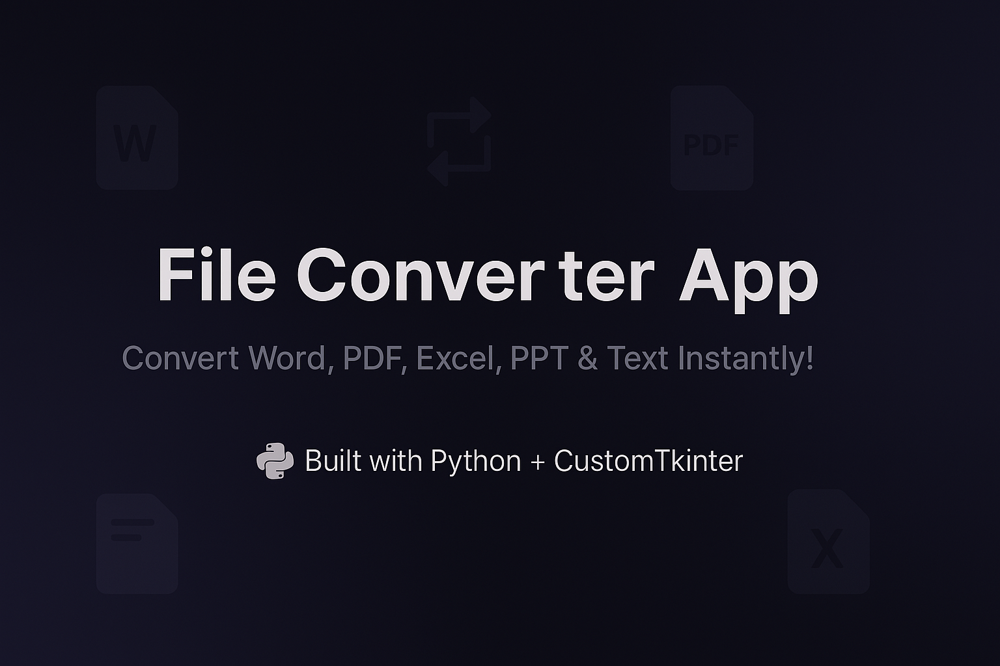
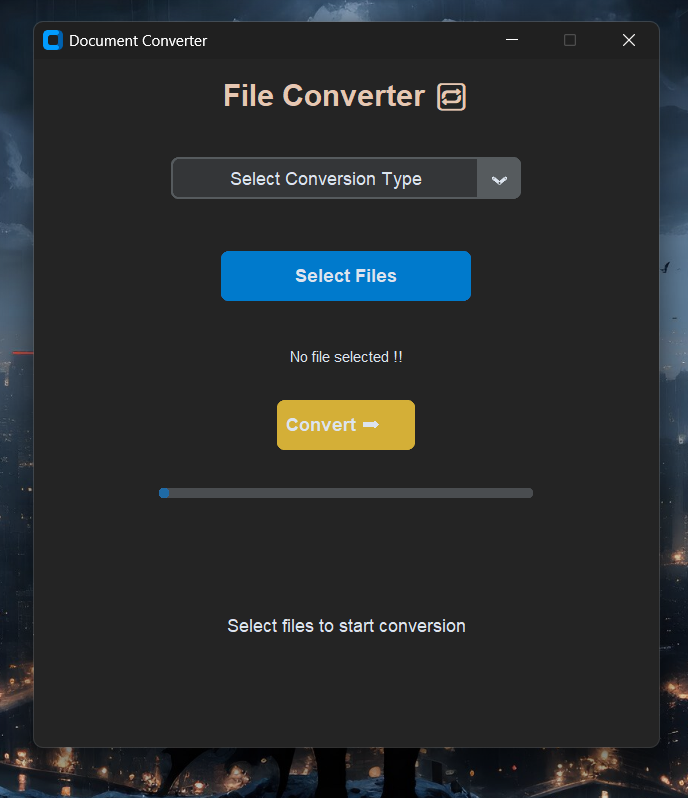
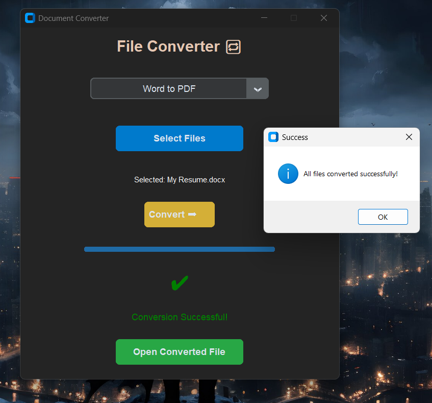

# 📄 File Converter Application 🔁

A Simple & Powerful Desktop App to quickly convert files between formats like Word, PDF, PPT, Excel, Text — all from a clean and responsive GUI.

Built with Python, CustomTkinter, and COM automation for smooth document conversions. 🚀



---

## ✨ Features

- 📝 Word to PDF  
- 📄 PDF to Word  
- 📊 Excel to PDF  
- 📈 PPT to PDF  
- 📜 PDF to Text  
- 📑 Text to PDF  
- 🎨 Animated Title Color for a dynamic UI  
- 📂 Select Multiple Files at once  
- ✅ Progress Tracking and Success Indicator  
- 🔓 Open Converted Files directly from the app  

---

## 📸 Screenshots

### Home Screen


### After Conversion



---

## 🛠️ Tech Stack

- Python 3.x  
- CustomTkinter — Beautiful modern UI  
- pdf2docx — PDF to Word conversion  
- PyMuPDF (fitz) — PDF Text Extraction  
- ReportLab — Text to PDF  
- pywin32 — COM Automation for Word, Excel, PowerPoint  
- tkinter — File dialogs and messages  

---

## 🚀 Getting Started

#### 1. Download The Converter ZIP from Release Section

```bash
Run .exe file after Unzipping and Enjoy
```

> Note: This app works on Windows systems since it uses MS Office COM automation.


---

## 📋 Requirements

- Python 3.8 or above  
- Microsoft Word, Excel, PowerPoint (Installed locally)  

---

## 📝 Usage

1. Select a conversion type from the dropdown.  
2. Click **Select Files** and choose one or more files.  
3. Press **Convert ➡️**.  
4. Open the converted file directly from the app if needed!

---

## ⚡ Future Improvements

- Add PDF to Image conversion.  
- Drag and Drop file selection.  
- Batch processing with multiple output paths.  
- Linux and MacOS support (non-COM based).  

---

## 🙌 Acknowledgements

Special thanks to the creators of:

- CustomTkinter  
- pdf2docx  
- PyMuPDF  

---

## 📫 Contact

Feel free to connect with me:

- LinkedIn: [Moin khan](https://www.linkedin.com/in/moin-khan-0335b4245/)

---

## ⭐ Give it a Star!

If you like this project, please ⭐ star it on GitHub — it motivates me to build more cool stuff!
